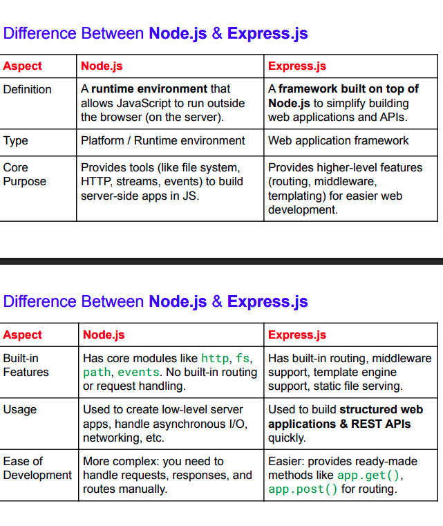

# Nodejs vs Expressjs

BUFEETCD
D efinition
T ype
C ore purposes
B uilt-in features
U sage
E ase of development
F lexibility
E xample
 <br>
flexibility : very flexible , but you need to build features yourself or use libraries | Opinionated but saves time with predefined structues and features
example:

```
javascript

const http = require('http');

http.createServer((req,res)=>{
    res.end("Hello from Nodejs");
    }).listen(3000);


expressjs
const express = require('express');
const app = express();
app.get('/',(req,res)=>{
    res.send("Hello from Expressjs");
});
app.listen(3000);


```
